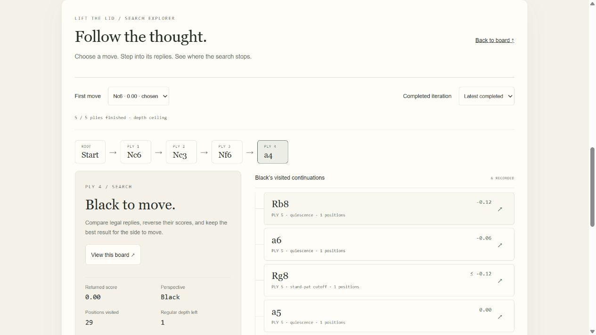

# Between Moves

Play an original browser chess engine and follow the actual search behind its decisions. All play, analysis and opponent adaptation run on the visitor's device. No model API, external chess service, runtime package, CDN or server-side computation is required. Static hosting has bandwidth and hosting costs of its own.

[Play the live demo](https://zulfkicar.github.io/playground/chess/) · [Portfolio](https://zulfkicar.github.io/)



## Run

```sh
npm start
```

Open http://127.0.0.1:8768. The dependency-free Node preview binds only to loopback and serves the app with module MIME types. Any ordinary static HTTP host also works. Use HTTP rather than a file URL, because the engine runs in a module Web Worker. The public demo serves these same static files.

## Play and study

- Select a piece and a highlighted destination. Arrow keys navigate the board, Enter selects, and Escape clears the selection.
- New game lets you choose either side or study a queen-versus-king or rook-versus-king ending. Studies are excluded from opponent memory.
- Set the depth ceiling from 1 to 12 plies and the thinking budget from 0.35 to 10 seconds. Only fully completed iterations are reported. A ceiling of 12 does not mean the engine will reach 12 within the budget.
- Play and Explore share one board. Play has Analysis, Moves, Profile and Settings tabs. Time and depth controls remain above the workspace.
- Analyze board searches without playing a move. It also works on an inspected tree position and retains its repetition history. Stop search cancels the worker and keeps the last completed result.
- In Explore, choose a first move or completed iteration, then follow its recorded replies. Selections update the board and highlight the last move. Manual branch navigation pins that completed iteration so incoming results cannot replace it. Breadcrumbs return to earlier nodes, and Start compares all searched first moves.
- Return to game exits inspection without changing the live game. Moves lets you review each played position. Phones provide Search details and View board shortcuts between the stacked views.
- Each node explains its source, score perspective, alpha-beta window, bound, visited positions, remaining regular depth and returned continuation. Additive static-evaluation bars describe the selected board separately.
- The tree records up to eight plies, six children per node and 2,400 descendants per completed iteration, plus all root moves. It is a bounded sample of real visits. Pruned and unrecorded children are disclosed. A cache hit is a leaf rather than a fabricated expansion.
- Analysis scores candidates from the searching side's perspective. The desktop meter uses White's perspective for the last analyzed root. It does not update automatically for every displayed board and is not a win probability.
- Take back reverses your last turn and the engine reply. Games export as PGN, including starting FEN for endgame studies. Games, settings, theme and memory persist in local browser storage. Nothing is uploaded.

## Engine

Original legal move generation supports castling, en passant, four promotion choices, check, mate and stalemate. Iterative deepening uses full-window root searches, alpha-beta negamax, capture ordering, killers and history ordering. Quiescence searches captures, promotions and check evasions, with a 12-ply tactical safety cap. Evaluation combines material, piece activity, pawn structure and phase-aware king activity.

The transposition table reuses scores only when the position, fifty-move clock and relevant repetition counts agree. A context hash indexes entries, followed by a canonical-context equality check. Mate scores are normalized by search ply. Separate position-only hints affect move ordering, not score correctness. The table is bounded to 12,000 entries and four million context characters. It survives iterative passes within one decision and is discarded with the worker.

The small original curated opening repertoire contains 13 standard lines. Book choices vary among legal repertoire moves, have no search score, and do not pretend to expand a tree. Analyze bypasses the book.

Original KQK and KRK distance-to-mate tables cover every legal king-plus-queen and king-plus-rook versus bare-king placement. Retrograde analysis selects fastest forced mate for the stronger side and longest defense for the weaker side. Capture-to-bare-kings and stalemate are draws. Probes respect this app's automatic fifty-move rule. Repeated-position histories fall back to normal search. Tables load from local static files, validate their size and SHA-256, and use Cache Storage when available. Gzip transfers are about 108 and 114 KiB. Browsers without stream decompression use the 512 KiB raw files. Failed loads fall back to search.

## Opponent memory

The last 30 completed standard games record the human's legal replies and opening sequences. Games are replayed and validated before counting. Unfinished, invalid, post-termination and custom-start games do not contribute. Taking back a completed game removes its observations. You can disable collection and use, forget individual recent games, or clear all remembered games.

Open Play → Profile to see opening sequences by side, observed capture frequency, and recorded replies with their counts. Select a position to inspect it on the board. Three visits mark eligibility, not confidence. The last engine move explains whether a final memory tie-break changed its choice. Analysis shows a direct link when it did. Empty memory offers a labelled sample preview that never enters saved records or engine input.

At least three observations at the same position are required before a reply record influences a choice. The engine still searches against best play. Historical replies can break a tie between candidates within 25 centipawns of its best searched score. They cannot change a forced-mate choice. This is a small statistical opponent model, not neural-network training, calibrated prediction or evidence of increased Elo.

## Verification

```sh
node --test engine.test.js upgrades.test.js rating-summary.test.js profile.test.js
node generate-tablebases.js
node upgrade-benchmark.js
```

Thirty-seven tests cover perft, special moves, draws, tactical regressions, legal deeper traces, cached-versus-uncached scores, table-guided mate with either color, fifty-move handling, memory eligibility and the adaptation safety limit.

An independent audit with python-chess checked 20,565 deterministic table positions, including every checkmate position in both tables. It checks legal-state validity and the min/max distance recurrence using independent legal moves. This is broad sampled verification, not an exhaustive independent audit of all table states. Reproduce with `python audit-tablebases.py` after installing `chess==1.11.2` in `.local/python` or your Python environment. Python is an audit tool, not an app dependency. See [audit results](reports/tablebase-audit.json).

The [fixed-depth search-work check](reports/upgrade-search-check.json) compares this build with frozen v2 on four positions. It measures work at completed depth 4 with tracing enabled, not playing strength. Source hashes and protocol limits are included. Wall-clock times are hardware-sensitive. Browser checks are recorded in [VERIFICATION.md](VERIFICATION.md).

## Strength and limits

**The upgraded build is unrated.** The previous v2 had a provisional fitted performance estimate of 1471, displayed as about 1450 on Stockfish's engine-rating scale. Its 28-game results, wide nominal sampling range of 1130–1841 and independent game audit remain available as historical evidence. They do not rate this upgraded engine or establish FIDE, Chess.com or Lichess strength. See [historical measurement](BENCHMARK.md).

`engine-v2.js` and `search-v2.js` preserve the measured v2 behavior with imports redirected to the frozen files. `engine-v1.js` preserves the first build. Historical match harnesses use frozen v2. A new match must exercise the current engine and specify whether opening play and local endgame tables are enabled before assigning a rating to the current app.

There is no trained evaluation, general Syzygy support, multiplayer, clock, drag-and-drop or arbitrary FEN import. Exact endgame coverage is limited to KQK and KRK. Horizon effects and tactical-extension limits can still cause mistakes. Threefold repetition and the fifty-move rule draw automatically here. Insufficient-material detection covers common cases rather than every dead position. The interface supports light/dark themes, reduced motion and responsive stacking, but it has not undergone a full accessibility or real touch-device audit.
